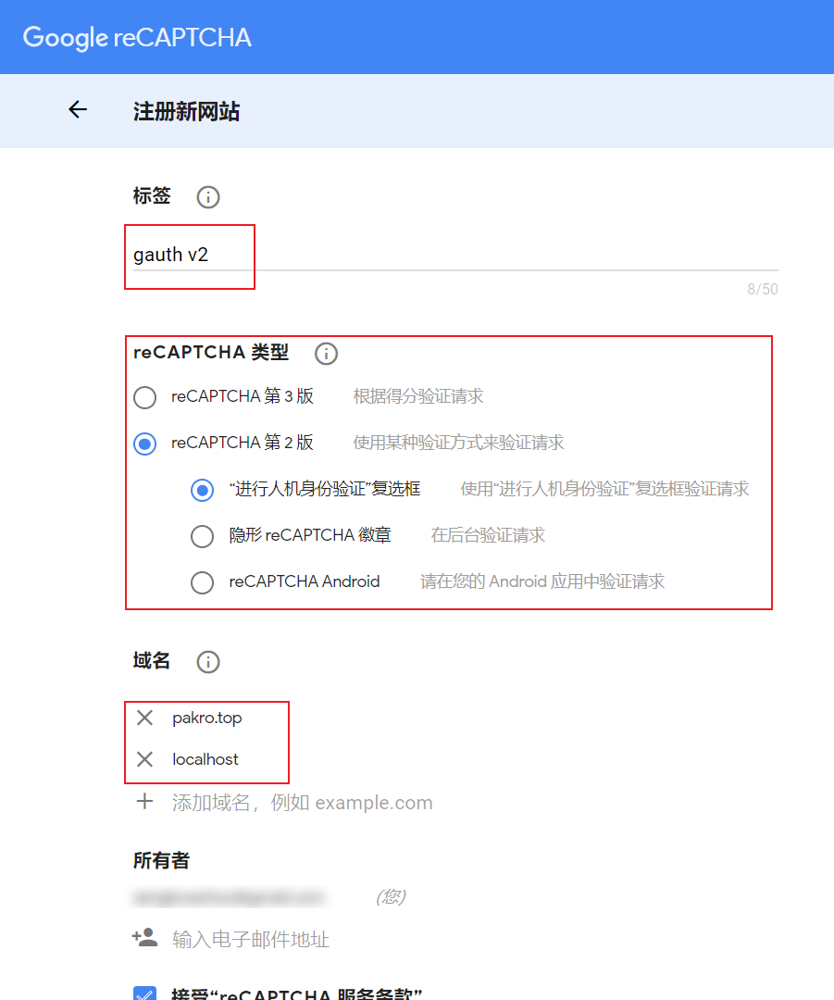
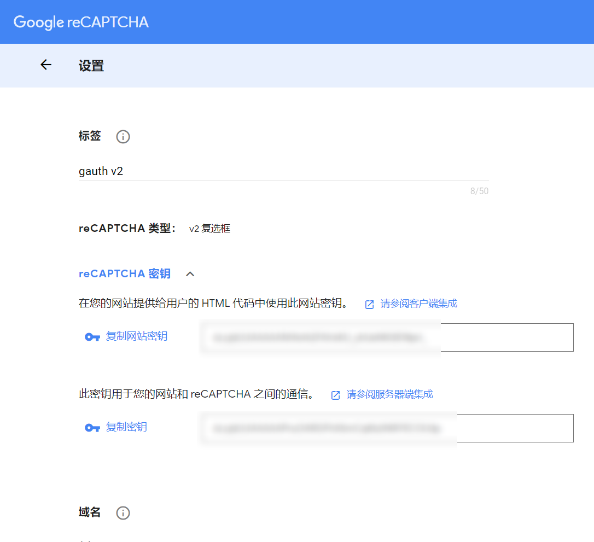
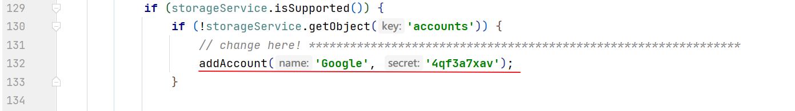
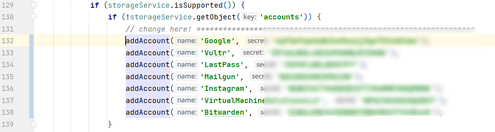
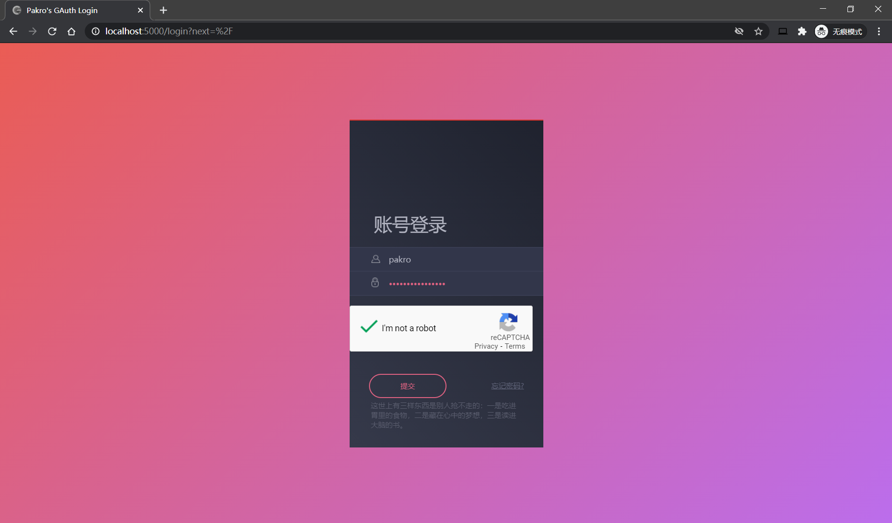
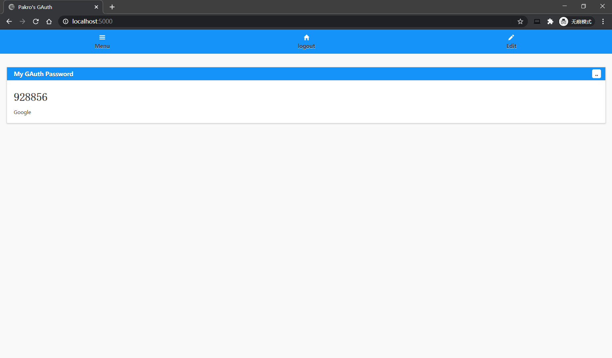

Gauth是什么？

使用Google身份验证器的你是否有时候担心手机丢失了，两步验证码找不回来？

有时候忘了带手机，不想拿手机出来，但是又需要查看自己的两步验证码？

使用Gauth即可解决你的问题！

~~标题党不好做啊~~

这个程序的目的就是解决不想拿出手机，又想看自己的两步验证码的问题。

## 使用教程

### 必要准备：

1.  一台VPS

2.  一个域名（必须）

3.  python3

### 前置准备：

首先clone代码

```shell
git clone https://github.com/WhyFear/MyGAuth
```

安装依赖包

```shell
cd MyGAuth
pip install -r requirements.txt
```

将.env_template名称改为.env

```shell
mv .env_template .env
```

### 申请reCAPTCHA keys

前往[官网申请](https://www.google.com/recaptcha/admin/create) ：

>   

-   标签随便填写，可以写一个方便记忆的。
-   reCAPTCHA 类型选择V2，同时勾选“进行人机身份验证”复选框。
-   域名填写根域名，不要填入子域名，同时添加一个本地地址，方便后期在本地测试。

>   

将上面的密钥填写到.env文件的RECAPTCHA_PUBLIC_KEY一项中，下面的密钥填写到RECAPTCHA_PRIVATE_KEY一项中。注意不要填反了。

### 其他.env项的填写

APP_SECRET_KEY可以随便填写，建议填写一个复杂的。这个不用记忆，只是为了加盐保证安全。

USER_ID 填写你的登录时用户名，比如pakro

USERNAME目前还没有作用，可以填写和USER_ID 一样

PASSWORD 密码，明文即可。

### gauth 导出key

如果你使用的身份验证器可以导出key那么可以直接跳过到下一步，如果没有的话，请跟着我做。

#### ios设备

不好意思，目前除了越狱没有办法将你的key导出。可以使用app的导出功能，然后使用安卓手机扫码导入，然后跟着安卓的操作走。

#### 安卓设备

首先确保已经开启了开发者模式，并打开了USB调试

 adb shell 连接手机 ，输入： 

~~~bash
adb pull /data/data/com.google.android.apps.authenticator2/databases/databases
~~~

##### linux设备

```shell
sqlite3 ./databases "select * from accounts" > google_authenticator_backup.txt
rm ./databases
cat google_authenticator_backup.txt
```

数据格式如下：

```
1|Google:me@gmail.com|XXXXXXXXXXXXXXXXXXXXXXXX|0|0|0||
2|Google:me@domain.org|XXXXXXXXXXXXXXXXXXXXXXXX|0|0|0|Google|Google:me@domain.org
3|Dropbox:me@gmail.com|XXXXXXXXXXXXXXXXXXXXXXXX|0|0|0|Dropbox|Dropbox:me@gmail.com
```

那一大堆的X就是我们需要的key了。

##### Windows设备

下载DB Browser for SQLite或者可以使用其他能够查看sqlite数据库的软件，打开databases文件即可。

### MyGAuth key的导入

打开static/js/gauth.js文件，转到132行

>   

按照addAccount('Google', 'XXXXXXX');的格式，一行一行添加内容。

>   

### 测试

此时可以在本地测试或者直接服务器启动服务看看工作是否正常了。

```shell
python3 app.py
```

打开http://localhost:5000/login

>   
>
>   

### 部署

首先获取几个信息

1.  

```shell
# 在MyGAuth文件夹中输入如下命令
pwd

# 如
[root@vps MyGAuth]# pwd
/var/www/gauth/
```

2.  

```shell
# 输入如下命令找到gunicorn安装位置
which gunicorn
# 如
[root@vultr ~]# which gunicorn
/usr/local/python3/bin/gunicorn
```

修改下面的两个内容：/var/www/gauth/ 、/usr/local/python3/bin/gunicorn、48224

48224可以改为自己喜欢的端口，如果没有前置代理，可以设置为80。但是我建议这样做。

```shell
nano /etc/systemd/system/gauth.service
# 填写如下内容

[Unit]           
Description=My GAuth
After=network.target

[Service]
Type=simple
WorkingDirectory=/var/www/gauth/
ExecStart=/usr/local/python3/bin/gunicorn -b 127.0.0.1:48224 app:app
Restart=on-failure

[Install]
WantedBy=multi-user.target
```

保存退出

```shell
systemctl daemon-reload
systemctl start gauth
# 查看运行状态
systemctl status gauth
# 如果运行状态是运行中
systemctl enable gauth
```

### caddy设置

如果你使用nginx可以参考其他文章的配置方法，下面给出我caddy1的配置方法

```shell
https://your.website.name {
  tls ***@***.com
  root /var/www/gauth
  proxy / localhost:48224 {
      transparent
  }
}
```

到此，设置完毕，可以开始使用了。